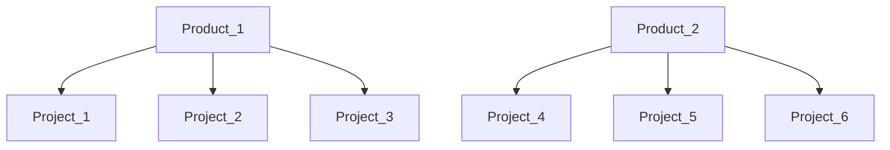

  

  

# Mend Integration for Azure Work Items cloud platform
### Self-hosted tool to proceed with integrations between Mend entities and Azure Work Items 
* The tool creates and updates Workitems tasks for a product\project in **Mend** Organization
* Full parameters (Azure variables) list is available below
* The tool can be configured by Azure DevOps variables
    
## Supported Operating Systems
- **Linux (Bash):**	CentOS, Debian, Ubuntu, RedHat
- **Windows (PowerShell):**	10, 2012, 2016

## Pre-requisites
* Python 3.9+

## Permissions
* The user used to execute the tool has to have "Organization Administrator" or "Product Administrator" on all the maintained products and "Organization Auditor" permissions
* It is recommended to use a service user
* A user must have permission to create and update Work Items tasks in the Azure DevOps organization 

## Installation on the Azure side:
1. Create a **pipeline** in your Azure organization and config it using the 
2. Configure the appropriate variables (secrets) in the Azure pipeline

### Command-Line Arguments and linked Azure variables
| Parameter                          |  Type  | Azure variable    | Required | Description                                                                                                                                                                                                      |
|:-----------------------------------|:------:|-------------------|:--------:|:-----------------------------------------------------------------------------------------------------------------------------------------------------------------------------------------------------------------|
| **&#x2011;&#x2011;help**           | switch |                   |    No    | Show help and exit                                                                                                                                                                                               |
| **&#x2011;&#x2011;wsurl**          | string | wsurl             |   Yes    | Mend server URL                                                                                                                                                                                                  |
| **&#x2011;&#x2011;userKey**        | string | userkey           |   Yes    | Mend User Key                                                                                                                                                                                                    |
| **&#x2011;&#x2011;apiKey**         | string | apikey            |   Yes    | Mend API Key                                                                                                                                                                                                     |
| **&#x2011;&#x2011;azureurl**       | string | azureurl          |    No    | Azure Server URL (default: `https://dev.azure.com/` )                                                                                                                                                            | 
| **&#x2011;&#x2011;azureorg**       | string | azureorg          |   Yes    | Azure Organization Name                                                                                                                                                                                          | 
| **&#x2011;&#x2011;azurearea**      | string | azurearea         |    No    | **FULL** path of Azure Area (default: Azure Project root)*                                                                                                                                                       | 
| **&#x2011;&#x2011;azurepat**       | string | azurepat          |   Yes    | Azure PAT ([Personal Access Token](https://docs.microsoft.com/en-us/azure/devops/organizations/accounts/use-personal-access-tokens-to-authenticate?view=azure-devops&tabs=Windows))                              |
| **&#x2011;&#x2011;azureproject**   | string | azureproject      |   Yes    | Azure project name                                                                                                                                                                                               |
| **&#x2011;&#x2011;azuretype**      | string | azuretype         |    No    | Type of created Azure object (WI or Bug. (default: `wi`)**                                                                                                                                                       |
| **&#x2011;&#x2011;wsprojecttoken** | string | wsprojects        |    No    | List of all your project's tokens that should be INCLUDED in the Sync process (separated by a comma)                                                                                                             |
| **&#x2011;&#x2011;wsproducttoken** | string | wsproducts        |    No    | List of all your product's tokens that should be INCLUDED in the Sync process (separated by a comma)                                                                                                             |
| **&#x2011;&#x2011;type**           | string | modificationtypes |    No    | [List of modification types](https://whitesource.atlassian.net/wiki/spaces/PROD/pages/2429681685/Issue+Tracker+Integration+-+API+Documentation#getOrganizationLastModifiedProjects) (default: `POLICY_MATCH`)*** |
| **&#x2011;&#x2011;utcdelta**       | string | utcdelta          |   Yes    | The delta between the local time of your **computer where you run tool** and **MEND's environment**                                                                                                              |

\* The area value could be like this **"SomeProject\\\SomeArea_1\\\SomeArea_2"**
      1. Please, pay attention that the **slash needs to be escaped as shown in the example**  
      2. if Area path contains **spaces** then the path must be enclosed in single quotes

\** 1. Possible values are : **INVENTORY,METADATA,SCAN,POLICY_MATCH,SCAN_COMMENT,SOURCE_FILE_MATCH** or **All** for all types   
   2. Please, pay attention that values should be provided **without** spaces as described above  

\***  1. In case **wi** all created Work Items will have type Issue  
    2. In case **bug** all created Work Items will have type Bug

**Example of products/projects definition**  

    If you want to include the sync process for all the projects of Product_1, as well as Project_5 and Project_6 from Product_2, then your parameters should be  
    wsproducts = ProductToken_1  
    wsprojects = ProjectToken_5, ProjectToken_6  
    **This configuration is equal to such a scheme:**  
    wsproducts =   
    wsprojects = ProjectToken_1, ProjectToken_2, ProjectToken_3, ProjectToken_5, ProjectToken_6  
