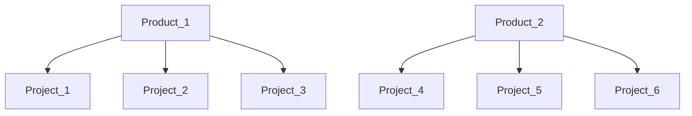

# WhiteSource Integration for Azure Work Items cloud platform - UNDER MAINTENANCE
### Tool to proceed integrations between WS entities and Azure Work Items 
* The tool creates and updates Workitems tasks for product\project in **WhiteSource** Organization. 
* Full parameters( Azure variables) list is available below
* The tool can be configured by Azure DevOps variables:
    
## Supported Operating Systems
- **Linux (Bash):**	CentOS, Debian, Ubuntu, RedHat
- **Windows (PowerShell):**	10, 2012, 2016

## Pre-requisites
* Python 3.9+

## Permissions
* The user used to execute the tool has to have "Organization Administrator" or "Product Administrator" on all the maintained products and "Organization Auditor" permissions.
* It is recommended to use a service user.
* The user has to have permissions for creating and updating Work Items tasks in Azure DevOps organization. 

## Installation on Azure side:
1. Need to create **pipeline** in your Azure organization with connection to Mend's repo https://github.com/whitesource-ps/ws-azure-workitems-integration 
2. Configure the appropriate variables in Azure pipeline.
3. Configure the CRON parameters in the Azure yml file.
   1. Recommended value is cron: "0 */1 * * *". It means running tool every hour.
   2. This value set by default

## Example of Usage Azure variables.

wsuserkey = **your WS user Key**  
wsorgtoken = **your WS Org Token**  
wsurl = https://saas.whitesourcesoftware.com  
azureurl = https://dev.azure.com/  
azureorg = **Your Azure Org**  
azurepat = **Your Azure PAT (Personal Access Token)**  
modificationtypes = POLICY_MATCH
utcdelta = 0   
azureproject = **Name of your Azure project**  
wsproducts = **List of your WS product's tokens.**  Separated by comma 
wsprojects = **List of your WS product's tokens.**  Separated by comma

**Short description:**  
1. Sync tool can be run just for one Azure project at this moment  
2. **wsurl** is URL of Mend platform.
3. **azureurl** is URL of Azure DevOps cloud platform. The default value is https://dev.azure.com/  
4. **azurepat** is Personal Access Token for your Azure account.
   1. The instruction of getting PAT here: https://docs.microsoft.com/en-us/azure/devops/organizations/accounts/use-personal-access-tokens-to-authenticate?view=azure-devops&tabs=Windows  
5. **wsurl** is URL of WS cloud platform. The default value is https://saas.whitesourcesoftware.com
6. **modificationtypes** is a List of possible issue's types which can be used in sync process.  
   1. Possible values are : **INVENTORY,METADATA,SCAN,POLICY_MATCH,SCAN_COMMENT,SOURCE_FILE_MATCH** or **All** for all types 
   2. Please, pay attention that values should be provided **without** spaces as described above
7. **utcdelta** is delta between local time of your **server** and UTC. 
   1. For example, delta between local Israel time and UTS is **-3** hours, but if your Mend's server uses UTC time then utcdelta should set to 0  
8. **wsproducts** is a List of all your product's tokens that should be INCLUDED into Sync process. List separated by comma.      
9. **wsprojects** is a List of all your project's tokens that should be INCLUDED into Sync process. List separated by comma.
   1. Example

If you want to include to sync process all projects of Product_1 and Project_5 and Project_6 from Product_2 then you parameters should be  
wsproducts = Product_1  
wsprojects = Project_5, Project_6  
**This configuration is equal of the such scheme:**  
wsproducts =   
wsprojects = Project_1, Project_2, Project_3, Project_5, Project_6  
