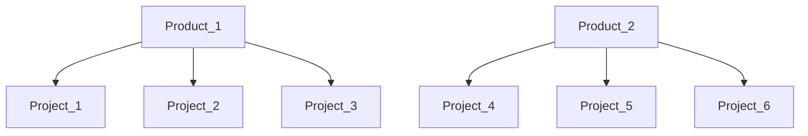

# Mend Integration for Azure Work Items cloud platform
### Self-hosted tool to proceed with integrations between Mend entities and Azure Work Items 
* The tool creates and updates Workitems tasks for a product\project in **Mend** Organization
* Full parameters (Azure variables) list is available below
* The tool can be configured by Azure DevOps variables
    
## Supported Operating Systems
- **Linux (Bash):**	CentOS, Debian, Ubuntu, RedHat
- **Windows (PowerShell):**	10, 2012, 2016

## Pre-requisites
* Python 3.9+

## Permissions
* The user used to execute the tool has to have "Organization Administrator" or "Product Administrator" on all the maintained products and "Organization Auditor" permissions
* It is recommended to use a service user
* A user must have permission to create and update Work Items tasks in the Azure DevOps organization 

## Requirements in Mend App:
1. Create an Issue Policy in Mend UI

## Installation on the Azure side:
1. Create a **pipeline** in your Azure organization and config it using the 
2. Configure the appropriate variables (secrets) in the Azure pipeline

## Example of Use Azure variables:
wsuserkey = **your Mend user Key**  
wsorgtoken = **your Mend Org Token**  
wsurl = https://saas.whitesourcesoftware.com  
azureurl = https://dev.azure.com/  
azureorg = **Your Azure Org**  
azurepat = **Your Azure PAT (Personal Access Token)**  
azurearea = **FULL** path of Azure Area  
modificationtypes = POLICY_MATCH
utcdelta = 0   
azureproject = **Name of your Azure project**
azuretype = **wi or bug**
wsproducts = **List of your Mend product's tokens.**  Separated by a comma 
wsprojects = **List of your Mend product's tokens.**  Separated by a comma

**Short description:**  
1. Sync tool can be run just for one Azure project at this moment  
2. **wsurl** is the URL of the Mend platform
3. **azureurl** is the URL of the Azure DevOps cloud platform. The default value is https://dev.azure.com/  
4. **azurepat** is Personal Access Token for your Azure account.
   1. The instruction for getting PAT is here: https://docs.microsoft.com/en-us/azure/devops/organizations/accounts/use-personal-access-tokens-to-authenticate?view=azure-devops&tabs=Windows  
5. **azurearea** is Full path of Area section in Work Item.
   1. Example. The area value could be like this **"SomeProject\\\SomeArea_1\\\SomeArea_2"**
      1. Please, pay attention that the **slash needs to be escaped as shown in the example**
      2. if Area path contains **spaces** then the path must be enclosed in single quotes
   2. If the value is undefined, the default value will be used.
6. **wsurl** is the URL of the Mend cloud platform. The default value is https://saas.whitesourcesoftware.com
7. **modificationtypes** is a List of possible issue types which can be used in the sync process  
   1. Possible values are : **INVENTORY,METADATA,SCAN,POLICY_MATCH,SCAN_COMMENT,SOURCE_FILE_MATCH** or **All** for all types 
   2. Please, pay attention that values should be provided **without** spaces as described above
8. **utcdelta** is a delta between the local time of your **computer where you run tool** and **MEND's environment** 
   1. For example, the delta between local Israel time and saas Mend'd environment is **-3** hours
9. **wsproducts** is a List of all your product's tokens that should be INCLUDED in the Sync process. List separated by a comma    
10. **azuretype** can accept the following values:  **wi** (by default) or **bug** 
    1. In case **wi** all created Work Items will have type Issue
    2. In case **bug** all created Work Items will have type Bug
11. **wsprojects** is a List of all your project's tokens that should be INCLUDED in the Sync process. List separated by a comma
    1. Example

    If you want to include the sync process for all the projects of Product_1, as well as Project_5 and Project_6 from Product_2, then your parameters should be  
    wsproducts = ProductToken_1  
    wsprojects = ProjectToken_5, ProjectToken_6  
    **This configuration is equal to such a scheme:**  
    wsproducts =   
    wsprojects = ProjectToken_1, ProjectToken_2, ProjectToken_3, ProjectToken_5, ProjectToken_6  
